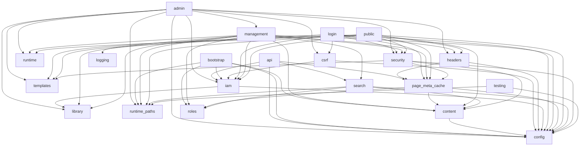
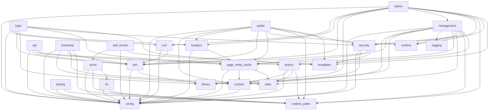

# Loose Coupling in Rust

This repository uses **compile-time composition** as the default architectural style.

The goal is to maximize:

* static resolution
* performance
* local reasoning
* independent development of modules
* build stability while interfaces evolve

The default tools are:

* **workspace crates** for module boundaries
* **traits** for contracts
* **generics** for composition
* **explicit wiring** in bootstrap code
* **small typed state bags** for shared Actix application state

We do **not** use runtime dependency injection patterns as a primary design approach.

## How To Read This In NoPressure Today

This document is **normative** for the coupling style we want in NoPressure. It is not limited to
the current Rust layout.

Today, much of the Rust code still lives inside the `nop` crate under `nop/src/`. Read the current
domain module boundaries (`public/`, `admin/`, `iam/`, `management/`, `security/`, `search/`,
`logging/`) as the present-day shape of boundaries that will continue to be decomposed.

Apply this document like this:

* when code is still inside one crate, keep the coupling aligned to the crate shape we want later
* treat `nop/src/main.rs` and management bootstrap code as the current composition edge
* continue using `actix_web::web::Data<T>` as small typed shared state bags rather than broad
  service-locator state
* prefer narrow traits only where substitution and independent evolution are real needs
* when a boundary is strong enough to stand on its own, decompose it into a dedicated workspace
  crate instead of letting the module boundary stay informal forever

This means the repository may not yet fully embody every rule below in all areas. The rules still
define the intended direction and should guide refactors and new work.

## Repository Mapping

To keep the guidance grounded in this repository:

* `nop/src/main.rs` is the main HTTP composition root and `nop` is glue-only, wiring shared state
  bags (`RequestTools`, `RenderTools`, `SecurityTools`, `LoginState`, `ManagementTools`,
  `RuntimePaths`) via Actix.
* `management::core::ManagementContext` is the management-side composition boundary and implements
  the narrow context traits required by extracted management domain crates.
* `iam::UserStore` is an example of a real internal seam where substitution is meaningful.
* `ValidatedConfig`, `PageMetaCache`, `SearchService`, `CsrfTokenStore`, and similar values are
  examples of typed shared Actix state bags.
* Management domain implementations live in `nop/crates/nop-management-*` and are used directly by the
  management bus and request layer (no `nop::*` re-exports).
* Runtime services are split into focused `nop/crates/nop-rt-*` crates rather than a single runtime bucket.
* Existing domain modules should be kept ready for extraction rather than deepening incidental
  coupling across `nop/src/`.

## Coupling Remediation Outcomes

This section captures the completed remediation decisions that are now part of the coupling
policy. It replaces the retired coupling remediation document.

### Glue-Only `nop` and Naming Rules

`nop` is glue-only. There are no `nop::*` re-export shims; dependents import crate paths
directly. `nop/src` keeps only the binary entrypoint plus `daemon` and `pid_file`.

Naming rules are strict:

* Cross-cutting runtime crates use the `nop-rt-*` prefix.
* Domain crates do not use the `rt` prefix.

### Cross-Domain Workflows (Management)

Cross-domain workflows are explicit application-level orchestrators for use cases whose effects
intentionally span more than one management domain. They encapsulate ordered side effects, error
handling, and consistency rules. Workflows live in `nop/crates/nop-management-workflows` and are
used directly.

This module is the only approved place where one management domain may cause side effects in
another. Domain modules must not directly author or own cross-domain side effects once the
workflow boundary is in place.

Examples of workflow-owned coordination:

* Removing a role updates role storage, rewrites tags and users, then triggers cache/search
  follow-up.
* Renaming a role updates the role definition, rewrites dependent tag/user references, then
  performs required downstream invalidation.

Workflow dependencies must be explicit and narrowly scoped. Domain modules should expose focused
capabilities needed by the workflow rather than sharing broad mutable context. Interface evolution
remains additive.

### Structural Direction for Management Domains

For management operations with true cross-domain behavior:

* Domain-local mutation logic stays in the owning domain.
* Cross-domain workflows coordinate multi-domain side effects.
* Management transport handlers dispatch to workflows or to domain-local operations depending on
  whether the use case is cross-domain or local.

Direction of travel for future extractions:

* Establish the workflow module inside the existing crate first.
* Migrate cross-domain side effects into workflows.
* Extract the workflow module into its own crate.
* Extract each management domain into its own crate once sibling-domain coupling is removed.

Concrete services are acceptable unless there is a real seam that needs substitution or
independent evolution. Narrow capability traits are required when a crate boundary is introduced.

Configuration follows the same principle. Full `ValidatedConfig` at bootstrap is acceptable
because it is system-start responsibility. After bootstrap, configuration should move toward
narrower interfaces where services or extracted crates need only a stable subset of settings.

### End-User Request Flows

End-user auth and profile flows are not management workflows. The request layer may own request
validation, rate limiting, return-path validation, cookie/JWT issuance, and response construction,
but it should not route ordinary end-user mutations through the management bus.

The target direction is:

* Keep the management bus focused on admin/connector-side operations.
* Provide clean user-facing interfaces for end-user capabilities such as password validation,
  profile update, and password change.
* Let the request layer call those interfaces directly.

Current request-layer auth flows:

* Login password validation calls `UserServices` directly from the request layer.
* Profile update and password-change flows use `UserServices` directly for mutation, token
  validation, and JWT refresh.
* Profile password-salt issuance is owned by `UserServices`.
* Login session state does not carry management connection or workflow identifiers.

### Shared Tools and State Granularity

Shared Actix state moves away from one broad application state bag toward smaller targeted
tool/state bags. These bags group related services by ownership and by likely future module/crate
boundaries rather than by incidental convenience.

Current tool/state bags:

* `RequestTools` groups templates and error rendering for request-bound rendering paths.
* `RenderTools` owns HTML sanitization for markdown rendering and centralizes sanitizer
  configuration.
* `SecurityTools` groups threat tracking and auth action rate limiting.
* `LoginState` owns login session storage.
* `ManagementTools` groups the management bus and upload registry.
* `RuntimePaths` is injected as its own state bag.

`RenderTools` remains a dedicated tool bag because the HTML sanitizer is a configured, reusable
builder that should be created once and shared across requests to keep rendering rules consistent
and avoid per-request configuration work.

### Contract and Runtime Crate Split

The crate split avoids a generic "core contract" basket. Contract crates exist only where there
is an external or wire seam, and runtime services are split into focused `nop-rt-*` crates rather
than a single runtime bucket.

Target split:

* `nop-config`: config schema, defaults, and validation.
* `nop-content-store`: content storage primitives (IDs, sidecars, reserved path rules).
* `nop-management-contract`: management domain/action IDs, request/response DTOs, wire enums,
  codec limits, and shared `Management*` request/response/error types.
* `nop-management-errors`: shared `DomainError`/`DomainResult` wrapper used by management domain
  handlers.
* `nop-management-roles`: role management domain handlers and role store.
* `nop-management-tags`: tag management domain handlers and tag store.
* `nop-management-users`: user management domain handlers.
* `nop-management-content`: content management domain handlers.
* `nop-management-search`: search management domain handlers.
* `nop-library`: domain-neutral validation helpers shared across domains.
* `nop-iam-passwords`: password hashing and complexity helpers shared by IAM and management.
* `nop-rt-paths`: runtime root layout and path validation helpers.
* `nop-rt-release`: release tracker service.
* `nop-rt-logging`: logging rotation and log controller.
* `nop-rt-page-cache`: page metadata cache.
* `nop-rt-search-service`: search runtime service and ingest queues.
* `nop-roles`: role normalization and tag-role resolution shared across runtime services.
* `nop-management-yaml`: YAML read/write helpers for management domain stores.
* `nop-security-paths`: filesystem path validation helpers for safe file creation.

Runtime services used directly:

* `RuntimePaths` is implemented in `nop-rt-paths`.
* `ReleaseTracker` is implemented in `nop-rt-release`.
* `LogController` and log rotation utilities are implemented in `nop-rt-logging`.
* `PageMetaCache` is implemented in `nop-rt-page-cache`.
* `SearchService` is implemented in `nop-rt-search-service`.

Domain crates depend on these services and contracts; none of the `nop-rt-*` crates depend on
extracted domain crates.

### Access Model Ownership

`AccessRule` lives in `nop-management-contract::roles`. Wire encoding/decoding is implemented
alongside the contract types. `nop-library` remains reserved for dependency-free, cross-domain
helpers (for example validation).

### Testing Scope for Coupling Boundaries

Testing must reinforce decoupling:

* Add focused tests for each cross-domain workflow covering success, partial-failure handling,
  and required invalidation/search effects.
* Keep domain-handler tests local unless the handler explicitly owns workflow dispatch.
* Update integration tests in `nop/tests/` to verify externally visible outcomes of
  workflow-driven management mutations.

Full verification suite:

```bash
scripts/crg.sh nop fmt --all
scripts/crg.sh nop clippy -- -D warnings
scripts/crg.sh nop test
cd nop/ts/admin && npm run check && npm run test
cd nop/ts/login && npm run check && npm run test
cd tests/playwright && npm install && npx playwright install && npm run test:e2e
```

### Current Dependency Map (Crate-Level)

The dependency map is verified with `cargo modules dependencies --lib --no-externs --no-fns
--no-types --no-traits --no-owns` (library target). This is the authoritative graph for crate
extraction sequencing because it reflects the `nop` library surface. Standalone modules not
exposed through `lib.rs` (for example `acme`, `tls`, `well_known`, and `main`) are not included by
`cargo-modules` and are captured in the supplemental full-source map below.

Library target:



Full source map:



Cycle summary:

* Library target cycles: none detected.
* Full source cycles: none detected.

## 0. Domain Modules vs. Library Helpers

The `library` module is reserved for **domain-neutral, dependency-free helpers** (for example
validation functions). It must not accumulate domain-specific rules.

Rules:

* Domain-specific behavior belongs in a **domain module** (for example `roles`, `search`,
  `management`), not in `library`.
* There is no catch-all `types` module. Types live with their owning domain unless they are truly
  domain-neutral, in which case they belong in `library`.
* If a cross-domain concept emerges (for example roles), it should become its own module rather
  than being placed in `library`.

---

## 1. Crate boundaries

Code must be split by responsibility into separate workspace crates where that improves ownership
and parallel development.

Use this shape by default:

* `*_api` or `*_contract`: shared traits and shared types
* `*_impl_*`: concrete implementations
* `app` or domain/application crates: orchestration and use cases
* `bin` crate: process startup and wiring

Crate naming convention:

* Workspace crates use the `nop-<area>` prefix (for example, `nop-core`, `nop-config`,
  `nop-management-contract`).
* Keep names flat and descriptive; avoid extra hierarchy unless a boundary truly needs it.

Rules:

* Shared contracts go in a dedicated boundary crate.
* Concrete implementations do not define the contracts they satisfy unless they are purely
  internal.
* Consumers depend on contract crates, not on implementation crates.
* Wiring happens at the edge of the program, typically in `main` or a bootstrap module.

NoPressure note:

* A boundary may begin life as a module inside `nop/src/`, but that should be treated as a staging
  state, not the target architecture for strongly owned domains.

---

## 2. Traits define boundaries

Every cross-module dependency must be expressed in terms of a trait when the dependency is intended
to be substitutable or independently developed.

Rules:

* Traits must be **small** and **capability-oriented**.
* Traits must be owned by the consuming side or by a dedicated contract crate.
* Traits must describe required behavior only.
* Traits must not accumulate unrelated responsibilities.

Prefer:

```rust
pub trait UserReader {
    fn get_user(&self, id: UserId) -> Result<User>;
}

pub trait UserWriter {
    fn put_user(&self, user: User) -> Result<()>;
}
```

Do not prefer:

```rust
pub trait UserStore {
    fn get_user(&self, id: UserId) -> Result<User>;
    fn put_user(&self, user: User) -> Result<()>;
    fn delete_user(&self, id: UserId) -> Result<()>;
    fn list_users(&self) -> Result<Vec<User>>;
}
```

unless all consumers genuinely require the full surface.

NoPressure note:

* Keep using traits selectively where the seam is real, as with user-store abstractions. Do not
  add traits mechanically for every sibling module inside `nop/src/`.

---

## 3. Generics are the default composition mechanism

Cross-module composition must use generics and trait bounds by default.

Prefer:

```rust
pub struct UserService<S: UserReader> {
    store: S,
}
```

Also acceptable:

```rust
pub struct UserService<S>
where
    S: UserReader,
{
    store: S,
}
```

Rules:

* Use generic parameters for dependencies whenever the implementation choice is known at compile
  time.
* Favor static dispatch unless runtime dispatch is required by an actual use case.
* Keep trait bounds narrow and local.

---

## 4. Runtime polymorphism is opt-in, not default

`dyn Trait` is allowed only when runtime selection is required.

Valid uses include:

* plugin loading
* heterogeneous collections
* runtime-selected adapters from configuration
* APIs that must erase type differences across branches

Rules:

* Do not use `Box<dyn Trait>` or `Arc<dyn Trait>` by habit.
* Use trait objects only when generics or enums are materially worse for the concrete use case.
* Any use of runtime dispatch should be explainable in one sentence.

---

## 5. Enums are preferred for closed implementation sets

When the set of implementations is known and intentionally closed, use an enum instead of trait
objects.

Example:

```rust
pub enum UserStore {
    Memory(InMemoryUserStore),
    Postgres(PostgresUserStore),
}
```

Rules:

* Use enums when variants are known inside this repository and are not intended as an open
  extension point.
* Prefer enums over trait objects for closed sets.
* Keep the enum in the layer that owns the selection decision.

---

## 6. Wiring happens in one place

Dependency assembly must be explicit.

Rules:

* Construct implementations in bootstrap code.
* Pass dependencies through constructors.
* Do not hide construction behind global registries or service locators.
* Do not use ambient mutable application state as a dependency mechanism.

Prefer:

```rust
fn main() {
    let store = PostgresUserStore::new(...);
    let service = UserService::new(store);
    run(service);
}
```

Do not prefer a shared `AppContext` unless the scope is deliberately small and stable.

NoPressure note:

* Today this principle maps to `nop/src/main.rs` for HTTP composition and to management bootstrap
  code for management operations.

---

## 7. No default trait methods

This repository does **not** use default trait methods on boundary traits.

Rules:

* Every trait method must be required.
* Trait evolution must not rely on default implementations.
* We do this to avoid compatibility ambiguity and hidden semantic drift.

If new behavior is needed, add a new trait.

---

## 8. Interface evolution is additive

Interfaces must evolve additively.

Rules:

* Do not add required methods to an existing widely-used trait.
* Do not broaden an existing trait just because one consumer needs more.
* Add a new trait for each new capability.
* Existing consumers must continue compiling unchanged unless there is a deliberate breaking
  change.

Prefer:

```rust
pub trait UserReader {
    fn get_user(&self, id: UserId) -> Result<User>;
}

pub trait UserLister {
    fn list_users(&self) -> Result<Vec<User>>;
}
```

Not:

```rust
pub trait UserReader {
    fn get_user(&self, id: UserId) -> Result<User>;
    fn list_users(&self) -> Result<Vec<User>>;
}
```

if `list_users` is new and not universally needed.

---

## 9. Version capabilities by trait, not by mutation

When a contract grows, introduce a new trait rather than mutating the old one.

Prefer:

```rust
pub trait UserReader {
    fn get_user(&self, id: UserId) -> Result<User>;
}

pub trait UserSearch {
    fn find_users(&self, query: &UserQuery) -> Result<Vec<User>>;
}
```

or, if a hierarchical relationship is useful:

```rust
pub trait UserReader {
    fn get_user(&self, id: UserId) -> Result<User>;
}

pub trait UserReaderSearch: UserReader {
    fn find_users(&self, query: &UserQuery) -> Result<Vec<User>>;
}
```

Rules:

* New traits should be named by capability, not by numeric suffix, unless a true versioned
  migration is in progress.
* Prefer `UserSearch` over `UserReaderV2`.
* Numeric suffixes are acceptable only for short-lived migration periods.

---

## 10. Consumers depend on the minimum contract

A module must depend only on the capabilities it actually uses.

Rules:

* Constructor signatures must use the smallest trait surface possible.
* Do not accept a broad trait when a narrower trait will do.
* Do not couple read-only code to write capabilities.

Prefer:

```rust
pub struct GetUser<S: UserReader> {
    store: S,
}
```

Not:

```rust
pub struct GetUser<S: UserStore> {
    store: S,
}
```

when only reads are needed.

---

## 11. Shared types belong at the boundary

Types that cross crate boundaries must live in the contract crate unless there is a strong reason
otherwise.

Rules:

* Request/response structs shared across modules go in the boundary crate.
* Core identifiers and domain-neutral DTOs go in the boundary crate.
* Implementation-specific internal types stay private to the implementation crate.

This keeps contracts explicit and reduces incidental dependency spread.

NoPressure note:

* This also applies to current internal boundaries. If a type is already acting as a cross-domain
  contract inside `nop/src/`, keep it clean enough to move to a contract crate later.

---

## 12. Avoid cyclic dependencies

Workspace crates must form a clear dependency direction.

Rules:

* Contract crates must not depend on implementation crates.
* Higher-level orchestration crates may depend on multiple contract crates.
* Implementation crates may depend on contract crates and internal utility crates.
* Cycles are not allowed.

Target direction:

`contract -> app/use-case -> bootstrap`

and

`implementation -> contract`

with selection happening only at the bootstrap edge.

NoPressure note:

* While boundaries are still modules, avoid creating the equivalent of future crate cycles through
  uncontrolled cross-imports between domains.

---

## 13. Features are not the interface-evolution mechanism

Cargo features are for conditional compilation, optional dependencies, and build-time product
shaping.

Rules:

* Do not use features to paper over contract drift between modules.
* Do not use features as a substitute for additive trait design.
* Use features only when the capability itself is optional at build time.

Examples of acceptable feature use:

* enabling a database backend
* enabling metrics
* enabling tracing
* enabling an HTTP transport

---

## 14. Testing must reinforce decoupling

Every boundary trait should be easy to fake in tests.

Rules:

* Application-layer tests should usually use in-memory or fake implementations.
* Tests should not require the real infrastructure unless the test is explicitly integration-level.
* If a component is hard to test without booting half the system, the dependency surface is too
  broad.

NoPressure note:

* Apply this alongside the existing split between unit tests, crate integration tests under
  `nop/tests/`, and Playwright system coverage.

---

## 15. Data bags and shared state

This repository allows shared data bags for cross-cutting state such as configuration, connection
pools, clients, and process-level services.

Data bags are allowed because they make it easy to add new shared capabilities independently. They
are not allowed to become a catch-all dependency surface.

### Policy

* Shared state must be split into **multiple small typed bags**, not one oversized `AppState`.
* Each bag must represent one coherent concern.
* Handlers and services must request only the bags they actually use.
* Adding a new shared capability must normally mean adding a **new bag type**, not expanding an
  existing bag arbitrarily.
* Large root state objects may exist only as bootstrap-owned assembly structures and must not be
  passed through the application verbatim.

Preferred examples:

* `AppConfig`
* `DbPool`
* `SearchClient`
* `MetricsHandle`
* `AuthSettings`

Not preferred:

* `AppState` containing config, pools, clients, feature flags, caches, and request metadata for
  the whole process

NoPressure note:

* The repository already follows this pattern in many handlers through separate `web::Data<T>`
  entries for config, caches, services, and request middleware support.

---

## 16. Actix app state rules

In this repository:

* use `web::Data<T>` for **process- or scope-level shared state**
* use request-local data for **per-request context**
* do not put request-local data into application-wide state bags

### Preferred shape

Register multiple independent types:

```rust
use actix_web::{App, web};

App::new()
    .app_data(web::Data::new(AppConfig::load()?))
    .app_data(web::Data::new(DbPool::new(...)))
    .app_data(web::Data::new(SearchClient::new(...)));
```

Consume only what is needed:

```rust
use actix_web::{HttpResponse, get, web};

#[get("/users/{id}")]
async fn get_user(
    db: web::Data<DbPool>,
    cfg: web::Data<AppConfig>,
    path: web::Path<UserPath>,
) -> HttpResponse {
    HttpResponse::Ok().finish()
}
```

### Do not centralize by default

Do not make this the default shape:

```rust
pub struct AppState {
    pub config: AppConfig,
    pub db: DbPool,
    pub search: SearchClient,
    pub metrics: MetricsHandle,
    pub auth: AuthSettings,
    pub cache: Cache,
}
```

and then inject `web::Data<AppState>` everywhere.

That pattern is allowed only when all of the following are true:

* the state is still small
* the fields are tightly related
* nearly every consumer genuinely needs most of it
* the type is acting as one cohesive unit, not as a service locator

Otherwise, split it.

---

## 17. Keep shared state extensible

To allow independent development:

* new cross-cutting capability means a **new bag type**
* existing handlers remain unchanged unless they need that capability
* unrelated consumers must not be forced to accept a widened shared-state struct

The basic rule is:

**add a bag, do not widen a universal bag**

---

## 18. Use scope-level state when appropriate

Not all state is global.

Rules:

* Put truly global state at the app level.
* Put bounded-context state at the route-scope level when only part of the router needs it.
* Prefer narrower registration when that reduces incidental coupling.

Examples:

* admin-only config under `/admin`
* feature-specific clients for a sub-router
* tenant-specific services under a tenant scope

---

## 19. Cheap clone rule

Shared Actix state should usually contain handles, pools, `Arc`s, or other cheap-clone resources.

Rules:

* Shared bags should contain cheap handles, not large mutable graphs.
* Do not expose broad internal object graphs through shared state.
* Shared state should hold stable infrastructure, not act as the in-memory model of the whole
  system.

---

## 20. Request context is separate from app state

Per-request context must be modeled separately from app-wide bags.

Use request-local context for:

* authenticated user
* correlation/request ID
* resolved tenant
* authorization outcome
* tracing decorations derived during middleware

Rules:

* Middleware writes request context.
* Handlers read request context.
* Request context types must stay small and purpose-specific.
* Request context must not be stuffed into global app state.

---

## 21. Module registration must stay modular

Large applications must keep route and module registration separate.

Rules:

* Each module should expose its own route/config registration function.
* Module registration should depend only on the bag types that module uses.
* Do not centralize all routing and dependency concerns into one giant startup file beyond final
  assembly.

NoPressure note:

* This maps directly to the existing `configure` pattern used across `public`, `admin`, `login`,
  `api`, and related modules.

---

## 22. Recommended default pattern

Use this as the default for new work:

1. Define shared types and a narrow trait in a contract crate.
2. Implement the trait in one or more implementation crates.
3. Make the consumer generic over that trait.
4. Wire the concrete implementation in bootstrap code.
5. Register shared Actix state as multiple small typed bags.
6. Let handlers extract only the bags they need.
7. When new capability is needed, add a new trait or a new bag type.
8. Keep old traits unchanged unless performing a deliberate breaking migration.

For current NoPressure work inside `nop/src/`, interpret step 1 as:

* first establish a clean module-local contract and ownership boundary
* then extract it into a dedicated contract crate when the decomposition is justified

---

## 23. Repository policy summary

In this repository:

* we prefer **workspace crate boundaries**
* we define **small capability traits**
* we use **generics by default**
* we use **explicit constructor wiring**
* we avoid **runtime DI patterns**
* we avoid **default trait methods**
* we evolve interfaces by **adding new traits**
* we keep consumers dependent on the **smallest possible contract**
* we use **trait objects only by exception**
* we use **enums for closed implementation sets**
* we use **many small typed state bags**
* we avoid **one universal `AppState`**
* we separate **app-wide state** from **request-local context**
* we register state at the **narrowest practical scope**
* when using `cargo modules dependencies --acyclic`, ignore item-level self cycles created by inherent constructors (for example `Type` ↔ `Type::new`). These are tool artifacts, not coupling or module-level cycles, and should not be surfaced to users or used as remediation signals.

The operating principle is:

**small traits, generic composition, explicit wiring, many small typed bags**

<!--
This file is part of the product NoPressure.
SPDX-FileCopyrightText: 2025-2026 Zivatar Limited
SPDX-License-Identifier: AGPL-3.0-or-later
The code and documentation in this repository is licensed under the GNU Affero General Public License v3.0 or later (AGPL-3.0-or-later). See LICENSE.
-->
